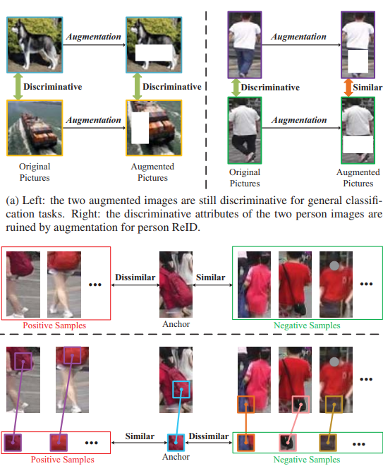
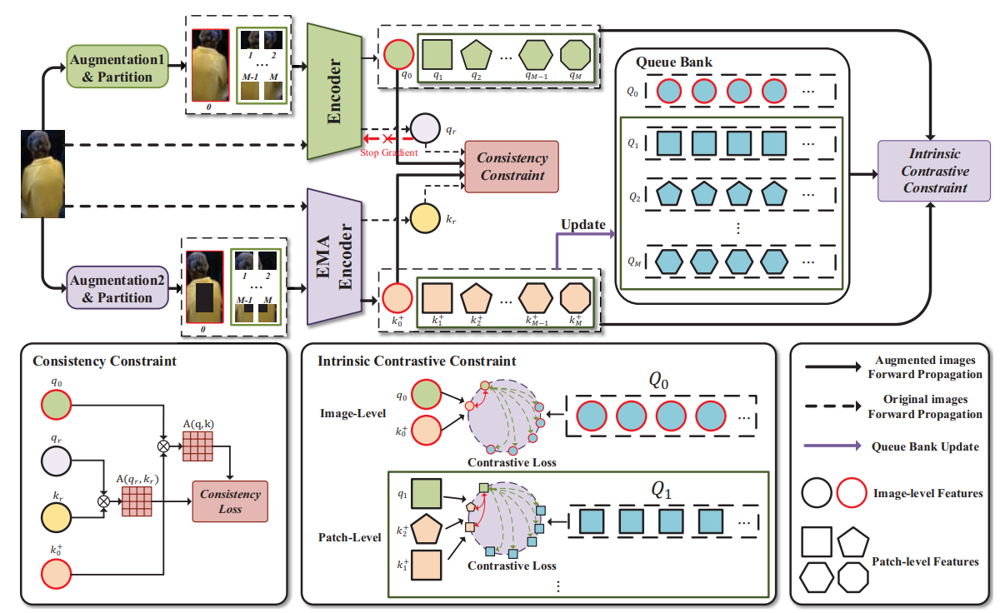
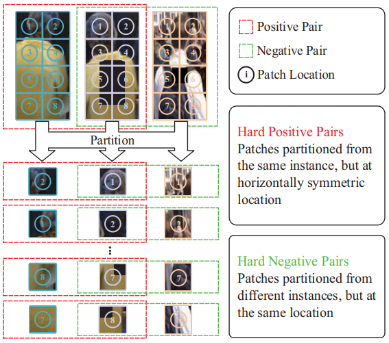
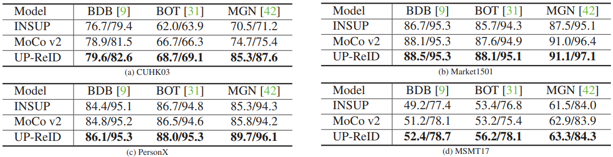
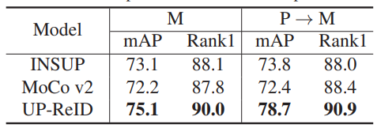
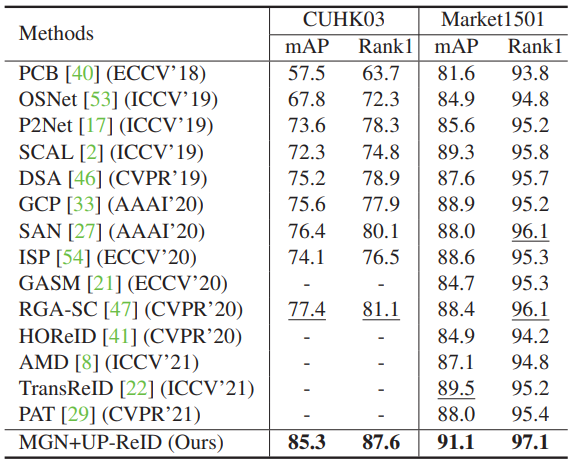
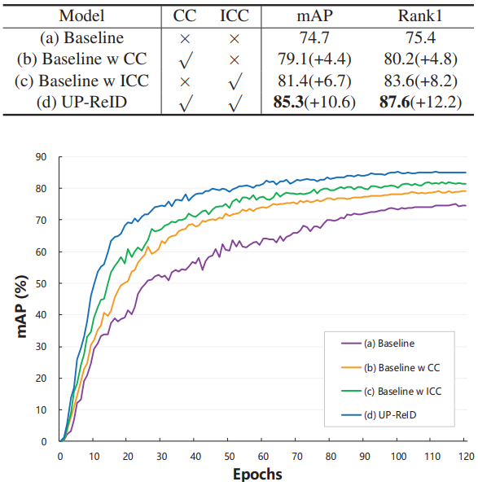
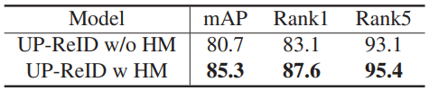
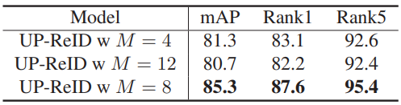

# 第一轮：

## 题目：

通过目标间的正则化释放非监督预训练的潜力。

**Q1: 整个工作在ReID中是什么位置？为什么要用非监督的预训练（UP）？——在本文中已经回答，是一个上游工作，预训练工作，为了给下游任务提供初始化的网络和参数；使用Unsupervised Pre-training的原因是受到对比学习方面成功的影响。
Q2: 为什么说是释放潜力，是否有其他工作可以跟进？——==需要继续思考==
Q3: 目标之间的正则化听上去是一个即插即用的模块，能否迁移到其他地方？——这两个约束模块基本都可以被对比学习参考。**

## 摘要：

由于对比目标的自监督学习的成功，本文设计了基于对比学习流程线的非监督预训练框架。
聚焦两个问题：

- 1、对比学习过程中图像增强导致人物判别困难。**Q4: 那为什么还要增强呢？——==增强的目的是为了对比学习，而不是简单的增强，其实这里就有可以说的，到底怎么增强是一个问题==**
- 2、图像的细粒度局部特征没有充分探索。**Q5: 如何得到这个结论？——这个是通过分析得出来的，相对来说是符合人的主观直觉的，具体在文章中写得比较少，但也确实有说明图**

解决办法：在UP-ReID中引入身份内正则化。具体表现为全局影像方面的约束和局部斑块方面的约束。用==全局一致性约束==来提高图像增强的鲁棒性。在每个图像的局部斑块之间采用==内在对比约束==来增强局部判别线索。

## 结论：

主要贡献有二：
- 1、提出预训练框架UP-ReID；
- 2、身份内正则化（全局一致性约束、内在对比约束）。

小贡献：引入了==困难挖掘策略==探索本地信息——以获得更好的表示学习。

## 图表：

图1。用图片描述了一些情况，一个是增强后导致区分错误，另一个是通过局部斑块增强识别。

图2。提议的UP-ReID架构。给定一个输入图像，经过两次不同的增强和分割，我们可以得到两组不同的增强实例。然后，将它们与原始图像一起分别送入在线编码器和EMA编码器。计算一致性损失以缩小增强图像与原始图像相似度分布之间的差距。我们还计算了基于精心设计的困难挖掘策略的内在对比损失。EMA编码器功能用于更新队列库。在线编码器通过总损失梯度优化，EMA编码器通过基于动量的在线编码器移动平均更新。

*Consistency loss：一致性损失，用来拉进增强图像和原始图像；==……==
Intrinsic contrastive loss：内在对比损失。==……==*

图3。困难挖掘策略的说明。我们选择从同一实例中分割的两个水平对称的补丁作为正对，从不同的实例中分割的两个补丁作为负对，但在相同的补丁位置。**Q6: 这个策略是为了做什么的？——详见问题10**

表1。使用不同预训练模型的三种代表性监督ReID方法在mAP/Rankl(%)方面的比较。“INSUP”是指ImageNet上的监督预训练模型，“MoCo v2”和“UP-ReID”分别是指LUPerson上的MoCo v2和我们的UP-ReID预训练模型。更多对比结果见附录。**Q7: 一个问题，这里不同的预训练和后期训练时怎么结合的，是预训练相同的编码器吗？——==这一块没有具体写==**

*BDB：Batch Drop Block 是一个由传统的ResNet-50作为全局分支和一个特征丢弃分支组成的双分支网络——ICCV 2019。
BOT：Bag of Tricks 是通过收集和评估许多最先进的方法中有效的训练技巧，并将这些技巧结合在一起——CVPRW 2019。*

*mAP：给每一类分别计算AP，然后做mean平均，AP是Precision-Recall Curve(PRC)下面的面积。
Rank1：一次命中的意思，一次检测就对了。*

其余图表基本就是说明效果，和几个策略的有效性，包括不同模型的对比、一致性约束和内在对比约束的有效性、困难挖掘的有效性、斑块数量的影响等。

# 第二轮：

## 介绍：

*细粒度分类：细粒度就是把具体的种类分出来，而不只是分出一个大类。*

ReID可以分为监督和非监督，而这些方法中大多数利用的是ImageNet上的预训练权重进行初始化，作者认为这里有两个问题：
- 1、预训练方法不适用于ReID；
- 2、ImageNet和ReID数据集差异大。

所以本文的目标是有效预训练一个初始化网络。使用的方法是无监督学习、对比学习。具体的上游文献，关系详见[Xmind](Unleashing_Potential_of_Unsupervised_Pre-Training_with_Intra-Identity_Regula.xmind)

而前人的工作中存在两个关键问题：

- 来自现有对比学习管道中使用的增强，这可能会损害人物图像的判别属性；
- 在以前的预训练方法中没有充分探索人物图像的细粒度信息。

提出自己的工作：提出UP-ReID框架，并引入身份内正则化。

贡献：

- 首次提出特定于ReID的预选连框架UP-ReID;
- 身份内部正则化的提出，是基于全图以及斑块级别实例化的，全图用于提高鲁棒性，斑块用于探索局部线索。

## 相关工作：

关系详见[Xmind](Unleashing_Potential_of_Unsupervised_Pre-Training_with_Intra-Identity_Regula.xmind)

## 方法：

ReID两个步骤：预训练和微调。

- 首先，模型会在一个大型数据集（LUPerson）上用一个代理任务进行非监督地预训练；
- 其次，预训练好的模型初始化骨干网络，然后用小尺度的数据集进行微调，有无标签均可。

本文聚焦第一个步骤，级预训练。

### 总括：

有两个编码器，一个在线编码器（fq）和一个动量更新编码器（fk）。它两都由特征编码器和投影组成。特征编码器是要被预训练的，投影部分是一个MLP。fq会被反向传播更新，fk通过fq的动量移动平均缓慢更新。$\theta k \leftarrow m\theta k + (1 - m)\theta q$

**Q8: 为什么要用动量这个东西？需要复习一下MoCo v2——动量是为了解决batch过大的问题，因为一个好的对比学习需要大量的对比，这给计算带来很大开销，MoCo为我们带来了字典的解决方案**

不同于一般的对比学习，本文将原始图像和增强图像一并进行了输入。**Q9: 这有什么用吗？——[回答](#A9)已完成**

把增强图像裁剪，然后和原图一起以队列输入编码器，设计了困难挖掘策略更好获取局部特征。**Q10: 为什么困难挖掘能取得更好效果？这个问题和Q6一致——==这里一方面是有实验的结果支持，但实际上具体问什么是这样有很多没有说清楚的：1、分成8块真的能获取到细粒度信息吗，很多时候还是不包含的；2、所说有先验的知识，但是不同人物之间的空间位置一定是对称的吗；至少存在以上两个问题没有说清楚。==**

设计了一个动态更新的bank，包括全图的特征以及斑块的特征，提供充足的负样本。用fk更新。

### 增强一致性

图像增强的作用不言而喻，但是在增强过程中可能破坏判别属性，使得样本和实例分离，和负样本接近。所以引入原始图像来增强监督，保持一致性。

两个增强图像的计算：$q = f_q(x_q)$    $k = f_k(x_k)$    $A(q,k) = q k^T$

原始图像的计算：$q_r = f_q(x_r)$    $k_r = f_k(x_r)$    $A(q_r,k_r) = q_r k_r^T$

损失计算：$L_{consist} = MMD(A(q,k),A(q_r,k_r))$

### 内在对比约束

$\mathcal{L}_g=-\log \frac{\exp \left(q_0 \cdot k_0^{+} / \tau_1\right)}{\exp \left(q_0 \cdot k_0^{+} / \tau_1\right)+\sum_{j=0}^{N-1} \exp \left(q_0 \cdot k_{0, j}^{-} / \tau_1\right)}$    $\mathcal{L}_{p_i}=-\log \frac{\exp \left(q_i \cdot k_p^{+} / \tau_2\right)}{\exp \left(q_i \cdot k_p^{+} / \tau_2\right)+\sum_{j=0}^{N-1} \exp \left(q_i \cdot k_{n, j}^{-} / \tau_2\right)}$

最终的内在对比损失是上面两个公式的加权和：$\mathcal{L}_{i n c}=\lambda_g * \mathcal{L}_g+\lambda_p * \frac{1}{M} \sum_{i=1}^M \mathcal{L}_{p_i}$ 其中$\lambda$是权重参数。

其中 $\mathcal{L}_g$ 计算相对明确，而 $\mathcal{L}_{pi}$ 的计算还依赖于 $k_p$ 和 $k_n$ 的选取策略。这在下一章会讲述。

### 局部特征探索的困难样本挖掘

为了更好地进行表征学习，基于人体水平对称的先验知识，设计了困难样本挖掘策略。

*这里其实暗含了一个信息，两种数据增强方式其实包含有对称的过程*

困难负样本选择：从不同实例的相同位置选择负样本，即 $Q_n=Q_i$ 这其实是一种比较合理的方式。**Q11：但是这里也存在一个问题，q和k实际上是对称的，那么q中的实际位置和作为负样本队列的Q的位置应该也是对称的，这个怎么说明是合理的呢？——这里和Q10类似**

困难正样本选择：选择同一位置和水平对称的斑块为正样本对。

在实际计算过程中，作者团队还考虑到一些极端情和水平对称的先验知识不一致，所以在正样本对的基础上增加了一个相同位置的负样本 $k_{i,j}^-$ 作为正样本，实际公式如下：

$\mathcal{L}_{p_i}=-\log \frac{\sum_{k_p^{+} \in \mathcal{P}(i)} \exp \left(q_i \cdot k_p^{+} / \tau_2\right)}{\sum_{k_p^{+} \in \mathcal{P}(i)} \exp \left(q_i \cdot k_p^{+} / \tau_2\right)+\sum_{j=0}^{N-1} \exp \left(q_i \cdot k_{i, j}^{-} / \tau_2\right)}$    $\mathcal{P}(i)=\left\{k_{i-h s}^{+}, k_i^{+}\right\}, k_{i, j}^{-} \in Q_i$

## 实验

### 实现

参数设置：预训练骨干网络ResNet50，优化器SGD，一个迷你批次的数量800，样本尺寸256×128，学习率0.1，分块数量M=8，Bank中的数量N=65536，$\tau_1=0.1,\tau_2=0.1,\lambda_g=0.8,\lambda_p=0.2$

数据增强，详读参考文献12，关系详见[Xmind](Unleashing_Potential_of_Unsupervised_Pre-Training_with_Intra-Identity_Regula.xmind)

先进行全局增强之后再进行切片划分，使得更为接近实际数据。

### 对监督ReID的提升

三种无监督预训练：MoCo v2、ImageNet预训练、UP-ReID；三个监督模型：BDB、BOT、MGN；

### 对无监督ReID的提升

用SpCL测试性能，需要读参考文献14，关系详见[Xmind](Unleashing_Potential_of_Unsupervised_Pre-Training_with_Intra-Identity_Regula.xmind)

### 最新比较和消融实验

